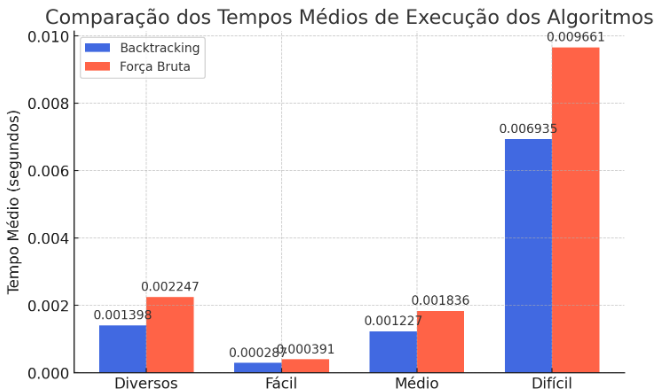

# 📄 Análise Comparativa de Algoritmos para Resolução de Sudoku 

## Descrição: 
Este projeto realiza uma análise comparativa de diferentes algoritmos para resolver jogos de Sudoku em diferentes níveis de dificuldade. Foram implementadas e testadas duas abordagens principais:

* Backtracking com otimizações

* Força Bruta recursiva com Backtracking

Os testes foram conduzidos em 115 jogos extraídos de bases de dados públicas e plataformas online, avaliando a eficácia e o tempo de execução de cada método.

## 📊 Resultados
Os testes mostraram que a abordagem de Backtracking otimizada apresentou um desempenho significativamente superior, especialmente para Sudokus mais complexos. O gráfico abaixo ilustra a diferença nos tempos médios de execução:




## 📂 Estrutura do Repositório
```
/sudoku
│
├── /artigo
│   └── analise-comparativa-de-algoritmos.png
│
├── /codigos
│   ├── /testeTempoExecucao
│   │   ├── backtracking2.py
│   │   ├── bruteforce2.py
│   ├── backtracking.py
│   ├── bruteforce.py
│
├── /db
│   ├── sudoku.py
│   ├── sudoku100.py
│   ├── sudokuFacil.py
│   ├── sudokuMedio.py
│   ├── sudokuDificil.py
|
├── /imgs
│   ├── comparacao.png
│   ├── sudoku-exemplo.png
│
└── readme.md
```
## 📚 Fontes de Dados
Os dados utilizados nos testes foram obtidos das seguintes fontes:
- [Kaggle - Sudoku Dataset](https://www.kaggle.com/datasets/rohanrao/sudoku)
- [Sudoku.com](https://sudoku.com/)

##### 

##### 

##### 

##### 

##### 

## 📖 Leitura do Artigo
Leia o artigo completo disponível [aqui](https://github.com/MelissaOliveiraC/sudoku/blob/main/artigo/analise-comparativa-de-algoritmos-para-resolucao-de-sudoku-melissaoliveira.pdf).

___

Desenvolvido por [@MelissaOliveiraC](https://github.com/MelissaOliveiraC) 